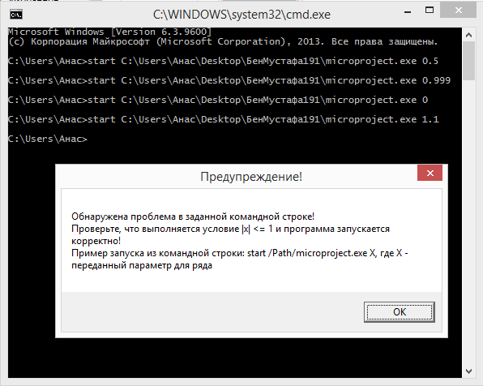
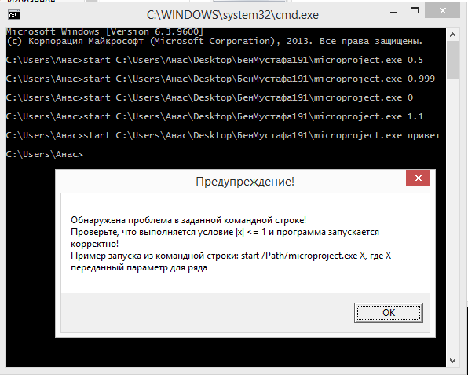
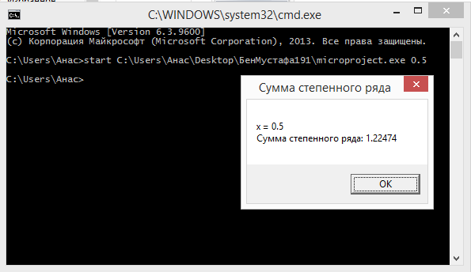
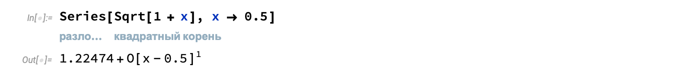
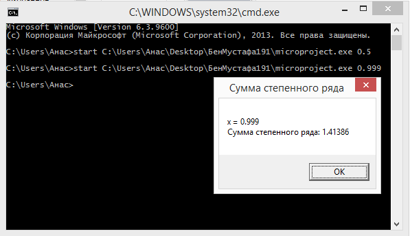
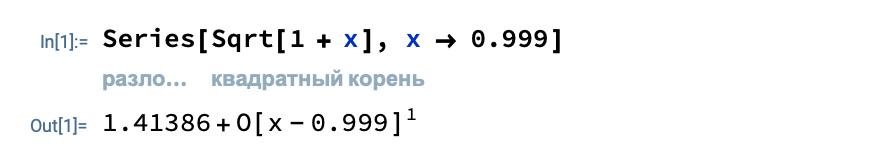
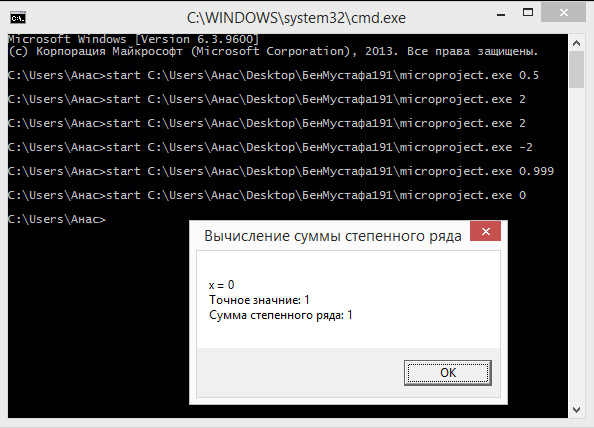
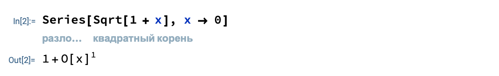

# MicroProjectFASM
## Микропроект по учебному курсу "Архитектура вычислительных систем", ПИ, 2 курс, НИУ ВШЭ. 
###
#### В качестве источников информации выступили:
<!--ts-->
  * Tomasz Grysztar. Flat Assembler Programmer’s Manual [Электронный ресурс]. – Официальный сайт FASM. Режим доступа: http://flatassembler.net/docs.php?article=manual  
  * https://www.tutorialspoint.com/assembly_programming/assembly_tutorial.pdf  
<!--te-->
#### Пояснительная записка к проекту представлена [здесь](Documents/Микропроект_БенМустафаАнас_191.pdf).
#### Код программы и файл EXE представлены [здесь](Materials/Code).
### Вариант 5. 
Разработать программу, вычисляющую с помощью степенного ряда с точностью не хуже 0,05% значение функции √(1 + 𝑥) для заданного параметра x (использовать FPU).
## Результаты работы программы
Правильность выполнения работы была проверена на многих тестах, ниже будут представлены некоторые из них.
## Тест 1
По условию задачи, задаваемый пользователем параметр Х должен быть меньше единицы по модулю. Убедимся в том, что программа проверяет выполнение данного условия:
- **Например, введём число 2 (некорректный ввод)** 
   
- **Аналогично работает для любого другого некорректного ввода, включая строки, не являющиеся числами** 
  При запуске программы пользователю предлагается следующий выбор:
   
## Тесты 2 - 4.
### Проверка правильности вычисления суммы ряда в программе производится через математическую среду разработки Wolfram Mathematica.
### Тест 2
- **Введём число 0.5, на выходе получаем ответ программы: 1,22478 (небольшая погрешность от правильного ответа, менее 0,05%)** 
   
- **Проверяем правильный ответ в среде Wolfram Mathematica** 
  При запуске программы пользователю предлагается следующий выбор:
   
### Тест 3
- **Введём число 0.999, на выходе получаем ответ программы: 1,41398 (небольшая погрешность от правильного ответа, менее 0,05%)** 
   
- **Проверяем правильный ответ в среде Wolfram Mathematica** 
  При запуске программы пользователю предлагается следующий выбор:
   
### Тест 4
- **Введём число 0, на выходе получаем ответ программы: 1 (погрешность отсутствует)** 
   
- **Проверяем правильный ответ в среде Wolfram Mathematica** 
  При запуске программы пользователю предлагается следующий выбор:
   
